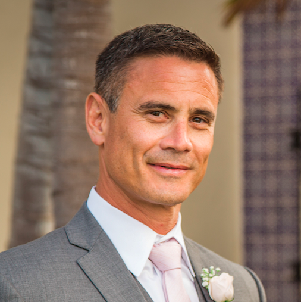

# Mark-Prodehl's Portfolio

## Motivation

Make a responsive website to host my web development portfolio and showcase myself and my applications to potential employers and clients. This version was made by using the Bootstrap's grid system and responsive classes to reduce the use of custom CSS. It is part of an ongoing project with the UCSD web development bootcamp program. 

## Screenshots

Portfolio is hosted here: https://github.com/markprodehl
